#### 深浅拷贝

深拷贝和浅拷贝值针对 Object 和 Array 这样的复杂类型

##### 浅拷贝

只复制对象第一层属性，如果基本类型则“传值”，若为引用类型，则“传址”

实现方法

1. Array.concat()、Array.slice()、Array.from()等

2. Object.assign()

   > 如果对象的属性值为简单类型，就是浅拷贝

3. es6 扩展运算符

   > 同 Object.assign()

##### 深拷贝

深拷贝是逐级对目标对象进行复制，会在栈内存重新分配空间存储新对象

实现方法

1. 通过 JSON 对象实现深拷贝（不考虑循环引用、Function、RegExp 的时候）

   > 1.无法实现对函数、RegExp 等特殊对象克隆 2.会将对象的 constructor 构造函数指向 Object 3.对象有循环引用时，会报错

2. Object.assign()

   > 如果属性值为对象或其它引用类型，就是浅拷贝

3. lodash cloneDeep()方法

4. 递归方式实现深拷贝，[案例](https://github.com/wang1xiang/learning-notes/blob/master/HandwrittenCode/js/deepClone.js)

#### 实现 new 方法

##### new 的过程中做了什么？

1. 创建一个空的对象
2. 给这个新对象构造原型链，链接到构造函数的原型对象上，从而新对象可以访问构造函数中的属性和方法
3. 执行构造函数中的代码，为新对象添加属性
4. 如果构造函数有返回值，则返回；否则默认返回新对象

##### 自己写代码实现 new

[案例地址](https://github.com/wang1xiang/learning-notes/blob/master/HandwrittenCode/js/myNew.js)

##### Object.create()

1. 语法 Object.create(proto, [propertiesObject])
2. 参数
   - proto：新建对象的原型对象，必须
   - propertiesObject：可选，添加到新建对象的可枚举属性，没指定则为 undefined
   - 返回值：指定原型对象上添加新属性后的对象
3. Objcet.create() vs new Object()
   - new Object()通过构造函数创建对象，添加属性是在自身实例，Object.create()是继承对象，添加的属性是在原型上
     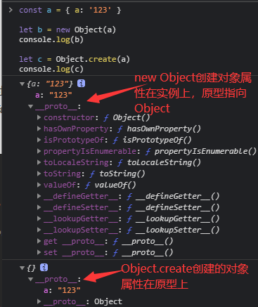
   - new Object()与 Object.create(null)区别
     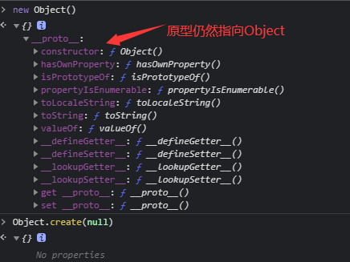

#### 防抖与节流

##### 防抖 debounce

> 函数防抖是函数短时间内连续触发时，在规定时间内，函数只会执行一次

- 案例
  - 搜索框输入搜索，停顿时搜索
  - 拖拽
- 代码实现

##### 节流 throttle

> 函数节流是短时间内大量触发同一时间，在函数执行一次之后，在指定的时间内不再被执行，直到过了这段时间才重新生效

- 区别
  debounce 限制多长时间才能执行一次，throttle 限制多长时间必须执行一次，一个限制上限、一个限制下限
  与防抖相比，节流函数最主要的不同在于它保证在指定时间内至少执行一次函数。
- 案例
  - 页面滚动
  - 窗口调整
- 代码实现

[可视化工具](http://demo.nimius.net/debounce_throttle/)帮助理解

#### Vue 响应式原理

##### 数据响应式原理

- vue2.x 通过 Object.defineProperty()，将 data 中的数据转为 setter/geter，实现响应式，[代码地址]()

  ```js
  let data = {
    msg: 'hello',
    title: 'nihao',
  }
  // 模拟 vue 实例
  let vm = {}
  Object.keys(data).forEach((key) => {
    Object.defineProperty(vm, key, {
      enumrable: true,
      configurable: true,
      get() {
        console.log('getter', data[key])
        return data[key]
      },
      set(newVal) {
        console.log('setter', key, newVal)
        if (newVal === data[key]) return
        data[key] = newVal
      },
    })
  })
  vm.msg = 'hello world'
  console.log(vm.msg)
  ```

  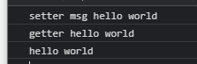

- vue3.x 通过 Proxy 实现，直接监听对象

  ```js
  let data = {
    msg: 'hello',
    title: 'nihao',
  }
  let vm = new Proxy(data, {
    get(target, key) {
      console.log('getter', key, target[key])
      return target[key]
    },
    set(target, key, newVal) {
      console.log('setter', key, newVal)
      if (newVal === target[key]) return
      target[key] = newVal
    },
  })
  vm.title = 'hello world'
  console.log(vm.title)
  ```

  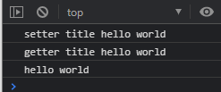

##### 发布订阅者模式

> vue 兄弟组件通信

```js
/*
  vue自定义事件
  this.$emit('change')
  this.$on('change', () => {
    console.log('change')
  })
 */

class EventEmitter {
  constructor() {
    this.subs = Object.create(null)
  }
  $on(eventType, handler) {
    this.subs[eventType] = this.subs[eventType] || []
    this.subs[eventType].push(handler)
  }
  $emit(eventType) {
    if (this.subs[eventType]) {
      this.subs[eventType].forEach((handler) => {
        handler()
      })
    }
  }
}

let em = new EventEmitter()
em.$on('change', () => {
  console.log('change event1')
})
em.$on('change', () => {
  console.log('change event2')
})
em.$emit('change')
```

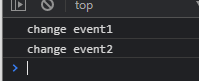

##### 观察者模式

> 观察者 watcher 和发布者 Dep 组成，事件发生时通过 notify 通知所有观察者

```js
// 观察者模式是由具体目标调度，比如当事件触发，Dep 就会去调用观察者的方法，所以观察者模式的订阅者与发布者之间是存在依赖的。
class Dep {
  constructor() {
    this.subs = []
  }
  addSub(sub) {
    if (sub && sub.update) {
      this.subs.push(sub)
    }
  }
  notify() {
    this.subs.forEach((sub) => {
      sub.update()
    })
  }
}

class Watcher {
  update() {
    console.log('update')
  }
}

let dep = new Dep()
let watcher = new Watcher()
dep.addSub(watcher)
dep.notify()
```

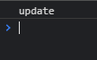

#### call、apply、bind 模拟实现

- 共同点：改变 this 指向，第一个参数都是 this 指向的对象
- 不同点
  - call 传参是单个传递，apply 传参是数组形式，bind 传值和传数组都可以
  - call 和 apply 函数执行是直接执行，而 bind 函数会返回一个函数，调用的时候才会执行

**注意**
箭头函数没有自己的 this，通过 call 或 apply 方法调用时，只能传递参数不能绑定 this，第一个参数会被忽略

##### 实现

```js
// 模拟实现call
Function.prototype._call = function (context, ...list) {
  context = context || window
  // 获取调用_call的函数，就是this
  context.fn = this

  let result = context.fn(...list)
  delete context.fn
  return result
}
const value = 'hello'
const foo = {
  value: 'nihao',
}

function bar(...list) {
  console.log(this.value)
  console.log(list)
}

bar._call(foo, 1, 2, 3)
bar._call(null, 4, 5, 6)

// 模拟实现apply
Function.prototype._apply = function (context, arr) {
  context = context || window
  context.fn = this

  let result = context.fn(...arr)
  delete context.fn
  return result
}

bar._apply(foo, [1, 2, 3])
bar._apply(null, [4, 5, 6])

// 模拟实现bind
Function.prototype._bind = function (context, ...arr1) {
  context = context || window
  context.fn = this

  return function (...arr2) {
    return context.fn(...arr1, arr2)
  }
}

bar._bind(foo, 1, 2)(3, 4)
bar._bind(null, 5, 6)(7, 8)
bar._bind(null)(5, 6, 7, 8)
```

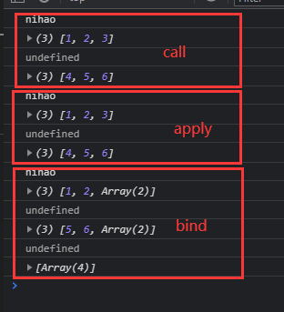

#### js 继承的多种实现方式和优缺点

- 原型链继承

  > 1. 实例既是子类的实例也是父类的实例，父类新增的方法/属性，子类都能访问
  > 2. 引用类型属性被所有实例共享
  > 3. 创建实例时，不能像 parent 传值

  ```js
  function Parent() {
    this.name = 'zhangsan'
    this.children = ['A', 'B', 'C']
  }
  Parent.prototype.getName = function () {
    console.log(this.name)
  }
  function Child() {}
  Child.prototype = new Parent()
  let child1 = new Child()
  child1.getName()
  child1.name = 'lisi'
  child1.children.push('name')
  console.log('child1', child1)
  let child2 = new Child()
  console.log('child2', child2)
  ```

  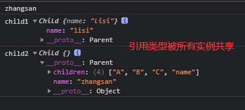

- 借用构造函数（经典继承）

  > - 借用父类构造函数增强子类实例，即复制父类实例属性给子类，继承父类实例属性和方法，不能继承原型属性和方法
  > - 优点：1.避免引用类型被所有实例共享 2.可以直接在 Child 中向 Parent 传参
  > - 缺点：方法都在构造函数中定义，每次创建实例都会创建一遍方法

  ```js
  function Parent(name) {
    this.name = name
    this.children = ['A', 'B', 'C']
    this.getName = function () {
      return this.name
    }
  }
  function Child(name) {
    Parent.call(this, name)
  }
  let child1 = new Child('zhangsan')
  child1.name = 'lisi'
  child1.children.push('name')
  console.log('child1', child1)
  let child2 = new Child('lisi')
  console.log('child2', child2)
  ```

  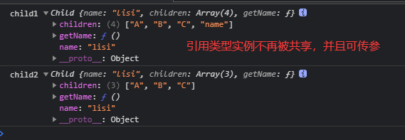

- 组合继承（原型链继承和经典继承双剑合璧）

  > 融合原型链继承和构造继承的优点，通过调用父类构造，继承父类属性并保留传参的优点，通过将父类实例作为子类原型，实现函数复用，是最常见的继承模式
  > 缺点：调用两次父类构造函数，第一次给子类的原型添加属性，第二次给子类的构造函数添加属性，覆盖子类原型的同名属性，造成性能上的浪费

  ```js
  function Parent(name) {
    this.name = name
    this.children = ['A', 'B', 'C']
    this.getName = function () {
      return this.name
    }
  }
  Parent.prototype.getChildren = function () {
    return this.children
  }
  function Child(name, age) {
    Parent.call(this, name) // 第二次调用父类构造函数
    this.age = age
  }
  Child.prototype = new Parent() // 第一次调用父类构造函数
  // 矫正 child 的构造函数
  Child.prototype.constructor = Child
  let child1 = new Child('zhangsan', 12)
  child1.children.push('D')
  console.log(child1)
  let child2 = new Child('lisi', 13)
  console.log(child2)
  ```

  > 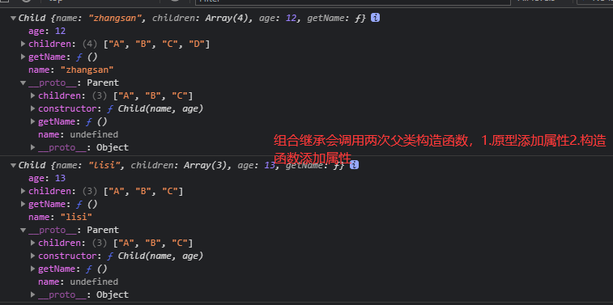

- 原型式继承

  > 本质是对原对象的一个浅拷贝
  > 父类的引用属性会被所有子类实例共享，子类构建实例时不能向父类传递参数

  ```js
  function createObj(o) {
    function F() {}
    F.prototype = o // 传入的对象作为创建对象的原型
    return new F()
  }
  let Parent = {
    name: 'name',
    children: ['A', 'B', 'C'],
    getName: function () {
      return this.name
    },
  }
  let child1 = createObj(Parent)
  child1.children.push('D')
  console.log(child1)
  let child2 = createObj(Parent)
  console.log(child2)
  ```

  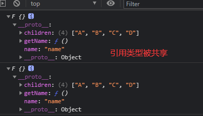

- 寄生式继承

  > 与工厂模式类似，创建一个用于封装继承过程的函数，在函数内部可增强对象
  > 父类的引用属性会被所有子类实例共享，子类构建实例时不能向父类传递参数

  ```js
  function createObj(o) {
    let clone = Object.create(o) // 使用原型式继承获得一个目标对象的浅复制，然后增强这个浅复制的能力
    clone.sayName = function () {
      console.log('say hello')
    }
    return clone
  }
  let Parent = {
    name: 'name',
    children: ['A', 'B', 'C'],
    getName: function () {
      return this.name
    },
  }
  let child1 = createObj(Parent)
  child1.children.push('D')
  console.log(child1)
  let child2 = createObj(Parent)
  console.log(child2)
  ```

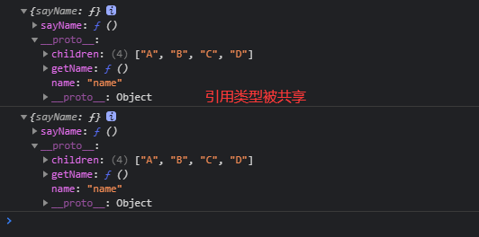

- 寄生组合式继承

  > 避免组合继承的缺点（两次调用父类构造函数），让 Child.prototype 间接访问到 Parent.prototype
  > 原型链保持不变,能正常使用 instanceof 和 isPrototypeOf

  ```js
  function Parent(name) {
    this.name = name
    this.children = ['A', 'B', 'C']
    this.getName = function () {
      return this.name
    }
  }
  Parent.prototype.getChildren = function () {
    return this.children
  }
  function Child(name, age) {
    Parent.call(this, name)
    this.age = age
  }
  // 设置 Child 的 prototype 指向 Parent
  // let F = function () {}
  // F.prototype = Parent.prototype
  // Child.prototype = new F()
  // 上面的三句话实际上就是类似于：Child.prototype = Object.create(Parent.prototype)
  Child.prototype = Object.create(Parent.prototype)
  let child1 = new Child('zhangsan', 12)
  child1.children.push('D')
  console.log(child1)
  let child2 = new Child('lisi', 13)
  console.log(child2)
  ```

  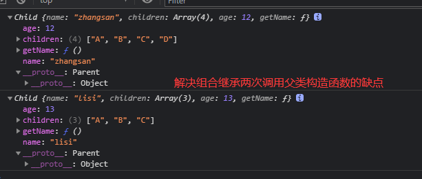

- ES6 继承

  > 先创造父类的实例对象（所以必须先调用 super 方法，然后再用子类的构造函数修改 this

  ```js
  class Super {
    constructor(foo) {
      this.foo = foo
    }
    printFoo() {
      console.log(this.foo)
    }
  }
  class Sub extends Super {
    constructor(foo, bar) {
      super(foo)
      this.bar = bar
    }
  }
  ```

#### 类型检测

##### 如何判断

1. typeof

   > 判断一个值属于哪种基本类型

   ```js
   typeof null // 'object' 无法判定是否为 null
   typeof undefined // 'undefined'

   typeof {} // 'object'
   typeof [] // 'object'
   typeof (() => {}) // 'function'
   ```

2. instanceof

   > 可以对引用类型进行判定，其原理就是测试构造函数的 prototype 是否出现在被检测对象的原型链上

   ```js
   [] instanceof Array            // true
   {} instanceof Object         // true
   (()=>{}) instanceof Function   // true

   let arr = []
   arr instanceof Array    // true
   // nstanceof 仍然无法优雅的判断一个值到底属于数组还是普通对象 Array 属于 Object 子类型
   arr instanceof Object   // true
   ```

3. Object.prototype.toString.call()

   > 该方法本质就是依托 Object.prototype.toString() 方法得到对象内部属性 [[Class]
   > 传入原始类型却能够判定出结果是因为对值进行了包装
   > null 和 undefined 能够输出结果是内部实现有做处理

   ```js
   Object.prototype.toString.call({}) // '[object Object]'
   Object.prototype.toString.call([]) // '[object Array]'
   Object.prototype.toString.call(() => {}) // '[object Function]'
   Object.prototype.toString.call('seymoe') // '[object String]'
   Object.prototype.toString.call(1) // '[object Number]'
   Object.prototype.toString.call(true) // '[object Boolean]'
   Object.prototype.toString.call(Symbol()) // '[object Symbol]'
   Object.prototype.toString.call(null) // '[object Null]'
   Object.prototype.toString.call(undefined) // '[object Undefined]'
   Object.prototype.toString.call(new Date()) // '[object Date]'
   Object.prototype.toString.call(Math) // '[object Math]'
   Object.prototype.toString.call(new Set()) // '[object Set]'
   Object.prototype.toString.call(new WeakSet()) // '[object WeakSet]'
   Object.prototype.toString.call(new Map()) // '[object Map]'
   Object.prototype.toString.call(new WeakMap()) // '[object WeakMap]'
   ```

##### 实现一个类型判断函数

1. 判断 null
2. 判断基础类型
3. 使用 Object.prototype.toString.call(target)来判断引用类型

> 先判断基础类型因为:虽然 Object.prototype.toString.call()能判断出某值为:number/string/boolean,但是其实在包装时是先将他们转为对象后再判断类型的,JS 包装类型和原始类型差别是使用 typepf 的值是 object

```js
function getType(target) {
  // 处理null
  if (target === null) {
    return 'null'
  }
  // 判断不是基础类型
  const typeofTarget = typeof target
  if (typeofTarget !== 'object') {
    return typeofTarget
  }
  // 此时已经是引用类型 使用Object.prototype.toString.call(target)
  const template = {
    '[object Object]': 'object',
    '[object Array]': 'array',
    '[object Function]': 'function',
    // 包装类型
    '[object String]': 'object - string',
    '[object Number]': 'object - number',
    '[object Boolean]': 'object - boolean',
  }

  const typeStr = Object.prototype.toString.call(target)
  return template[typeStr]
}
```

##### 模拟实现 instanceof

> 遍历左边变量的原型链，直到找到右边变量的 prototype，如果没有找到，返回 false

```js
function instanceOf(left, right) {
  const proto = left.__proto__
  const prototype = right.prototype
  while (true) {
    if (proto === null) return false
    if (proto === prototype) return true
    proto = proto.__proto__
  }
}
let a = []
console.log(getType(a))
console.log(instanceOf(a, Array))
console.log(instanceOf(a, Object))

let b = {}
console.log(getType(b))
console.log(instanceOf(b, Array))
console.log(instanceOf(b, Object))

let c = () => {}
console.log(getType(c))
console.log(instanceOf(c, Array))
console.log(instanceOf(c, Object))

let d = ''
console.log(getType(d))
console.log(instanceOf(d, String))
console.log(instanceOf(d, Object))
```

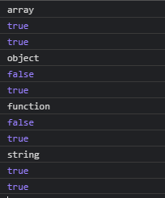

#### 数组去重

- 基本类型数组去重

  > 使用 Set 可对基本类型的数据去重

  ```js
  // 值为基本类型数组去重
  const uniqBy = (arr) => [...new Set(arr)]
  let a = [
    1,
    2,
    1,
    2,
    3,
    '1',
    '3',
    '1',
    true,
    false,
    true,
    undefined,
    undefined,
    null,
    null,
  ]
  console.log(uniqBy(a))
  let b = [{ a: 123 }, { a: 123 }]
  console.log(uniqBy(b))
  ```

  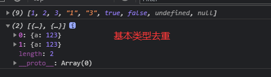

- 引用类型数组去重

  > 使用 Map 去重,键值不可重复

  ```js
  // 值为基本类型数组去重
  const uniqueBy = (arr, key) => [
    ...new Map(arr.map((item) => [item[key], item])).values(),
  ]
  const singers = [
    { id: 1, name: 'Leslie Cheung' },
    { id: 1, name: 'Leslie Cheung' },
    { id: 2, name: 'Eason Chan' },
  ]
  console.log(uniqueBy(singers, 'id'))
  ```

  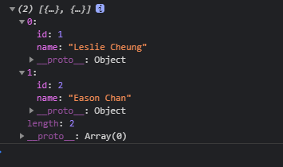
