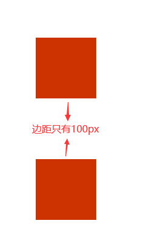
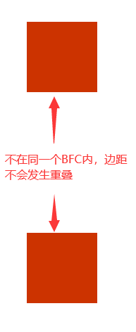

#### 谈一谈你对 BFC/IFC 的理解

> BFC 全称 Block Formatting Context，即块级格式化上下文，是为盒子准备的一套渲染规则

##### 格式化上下文 formatting Context

- 用于决定渲染文档的一个区域
- 不同的盒子使用不同的格式化上下文来布局
- 每个格式化上下文都拥有一套不同的渲染规则，决定其子元素将如何定位，以及和其他元素的关系和相互作用
- 常见的格式化有以下几种：
  1. Block formatting context BFC
  2. Inline formatting context IFC
  3. Grid formatting context GFC
  4. Flex formatting context FFC

##### 触发 BFC

只要元素满足下面任一条件即可触发 BFC 特性：

- 根元素（html）或其他包含它的元素
- 浮动元素：float 除 none 以外的值
- 绝对定位元素：position (absolute、fixed)
- 非块级盒子的块级容器：display 为 inline-block、table-cells、flex
- overflow 不为 visiable 的块级盒子（hidden auto scroll）

##### BFC 的特性

- 盒子从顶部开始垂直排列
- 两个相邻的盒子之间的垂直距离由外边距 margin 决定
- 块级格式化上下文中相邻的盒子之间的垂直边距折叠
- 每个盒子的左外边与容器的左边接触（从右向左格式化则相反），即使存在浮动也是如何，除非盒子建立了新的块级格式化上下文
- 形成了 BFC 的区域不会与 float box 重叠
- 计算 BFC 的高度时，浮动子元素与参与计算

##### 使用 BFC 解决问题

- 页面广告使用 BFC 创建，设置 position:absolute 或 position:fixed

- 同一个 BFC 下外边距会发生折叠

```html
<head>
  <style>
    div {
      width: 100px;
      height: 100px;
      background: #c30;
    }
  </style>
</head>
<body>
  <div></div>
  <div></div>
</body>
```

因为两个容器都处于同一个 BFC 容器（body）下，所以第一个 div 下边距和第二个 div 上边距发生重叠，两个盒子距离只有 100px

如果要避免外边距重叠，需要将其放在不同的 BFC 容器内

```html
<head>
  <style>
    * {
      margin: 0;
      padding: 0;
    }
    .container {
      overflow: hidden;
    }
    p {
      width: 100px;
      height: 100px;
      background: #c30;
      margin: 100px;
    }
  </style>
</head>
<body>
  <div class="container">
  </div>
  <p>
    <div class="container">
    </div>
  </p>
</body>
```



- 文字包围图片

  > 给 img 元素添加 float:left

- 清除浮动
  > 假设想实现两栏布局，可以给文字区域设置 float:left 或 float:right，此时两个元素都设置了浮动，脱离了正常的文档流，实际上浮动元素本身就是 BFC，浮动起来就是一个隔离区，解决浮动问题就需要使用 BFC，设置隔离区域把里面的内容隔离起来，也就是清除浮动，给父元素设置 overflow 触发 BFC

#### 实现两栏布局

```css
/* 1.flex布局 */
.container {
  display: flex;
}
.left {
  background: #e8e8e8;
  width: 100px;
  height: 100vh;
}
.right {
  flex: 1;
  background: #dedede;
  height: 100vh;
}

/* 2.float + margin */
.left {
  background: #e8e8e8;
  width: 100px;
  height: 100vh;
  float: left;
}
.right {
  background: #dedede;
  height: 100vh;
  margin-left: 100px;
}

/* 3.float + overflow */
.left {
  background-color: #e8e8e8;
  height: 100vh;
  width: 100px;
}
.right {
  background-color: #dedede;
  height: 100vh;
  width: 100vw;
  overflow: hidden;
}

/* 4.float + calc */
.left {
  background-color: #e8e8e8;
  height: 100vh;
  width: 100px;
}
.right {
  background-color: #dedede;
  height: 100vh;
  width: calc(100% - 100px);
}
```

#### 实现三栏布局

```css
/* 1.float + overflow */
.left {
  width: 100px;
  height: 100vh;
  float: left;
  background-color: #dedede;
}
.center {
  overflow: hidden;
  height: 100vh;
  background-color: #fff;
}
.right {
  width: 100px;
  height: 100vh;
  float: right;
  background-color: #dedede;
}

/* 2.position */
.left {
  position: absolute;
  width: 100px;
  height: 100vh;
  left: 0;
  background-color: #dedede;
}
.center {
  position: absolute;
  height: 100vh;
  right: 100px;
  left: 100px;
  background-color: #fff;
}
.right {
  position: absolute;
  width: 100px;
  height: 100vh;
  right: 0;
  background-color: #dedede;
}
/* 3.flex */
.container {
  display: flex;
}
.left {
  height: 100vh;
  width: 100px;
  background-color: #dedede;
}
.center {
  height: 100vh;
  flex: 1;
  background-color: #fff;
}
.right {
  height: 100vh;
  width: 100px;
  background-color: #dedede;
}
```

#### css 水平垂直居中

```css
/* 1. flex */
.wrapper {
  height: 100vh;
  display: flex;
  justify-content: center;
  align-items: center;
}
.container {
  width: 100px;
  height: 100px;
  background-color: #dedede;
}

/* 2.flex + margin */
.wrapper {
  height: 100vh;
  display: flex;
}
.container {
  width: 100px;
  height: 100px;
  margin: auto;
  background-color: #dedede;
}
/* 3.transform */
.container {
  position: absolute;
  left: 50%;
  top: 50%;
  transform: translate(-50%, -50%);
}
```
